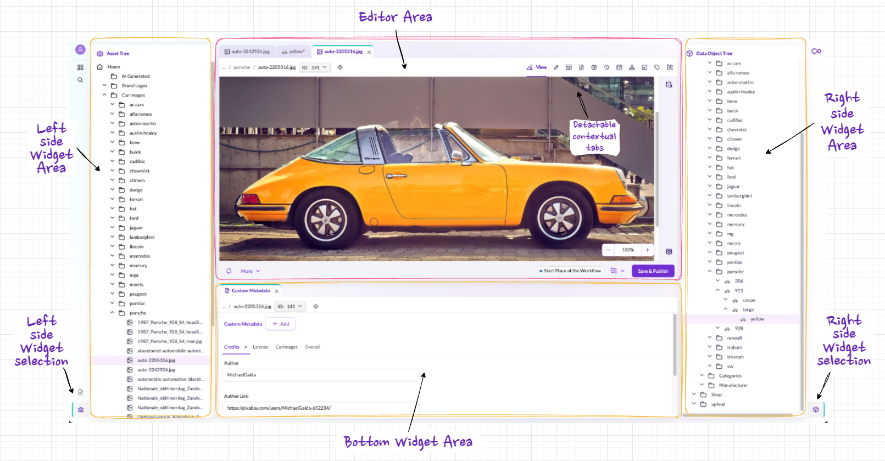
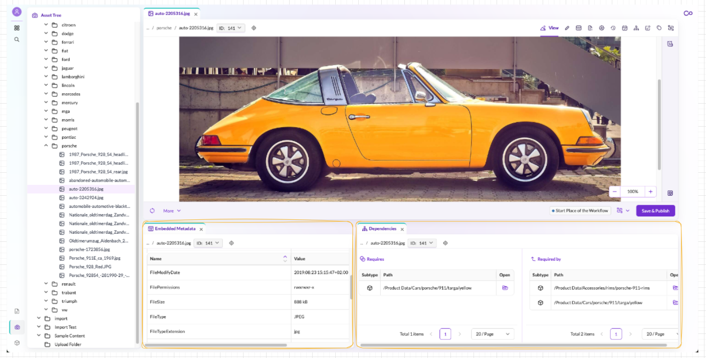
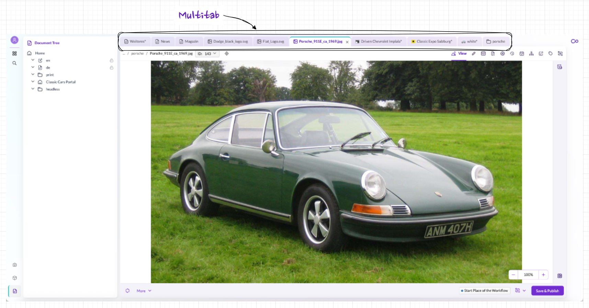
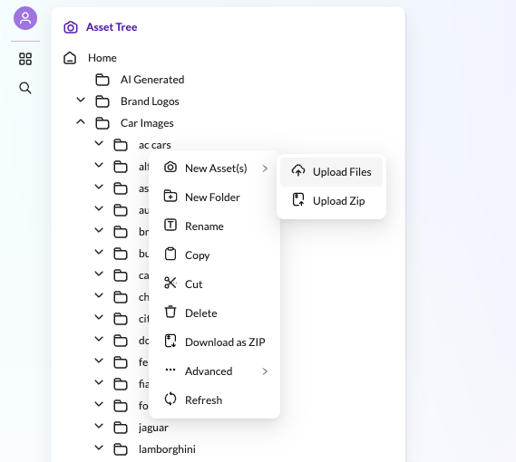
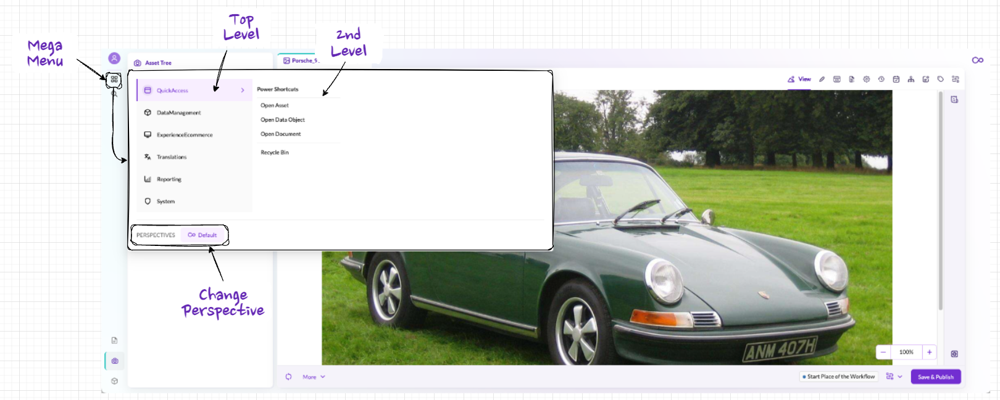

# Pimcore Studio UI

Pimcore Studio is the browser-based administration interface for managing all data in Pimcore. It is built as a React-based single-page application with a flexible, widget-driven layout that adapts to different roles and tasks.

This page introduces the core UI concepts. Detailed configuration and extension options are covered in the Studio Frontend documentation.

## Layout: Editor Area and Widgets

The interface is built around two core elements: a central **Editor Area** and surrounding **Widget Sections**.

### Editor Area

The Editor Area is the main workspace. It displays whatever item you are currently editing, whether that is a product data object, an image asset, a website page, or any other element. The editor provides the relevant editing tools for the item type: form fields for data objects, a WYSIWYG editor for documents, image tools for assets.

### Widgets

Widgets are collapsible panels that surround the Editor Area on the left, right, and bottom. Each widget serves a specific purpose:

- **Navigation trees** - hierarchical tree views for browsing Assets, Documents, and Data Objects
- **Detail panels** - metadata, versions, tags, dependencies, schedule, notes & events for the currently open item
- **Lists and galleries** - folder contents displayed as lists (for Data Objects) or thumbnail galleries (for Assets)

Widgets are **context-sensitive**: they automatically update their content based on what is open in the Editor Area. Open a product image, and the metadata widget shows that image's details. Switch to a different image, and all widgets update accordingly.

Widgets can be rearranged via drag-and-drop to fit your preferred working style.

## Multitab and Multiwindow

### Multitab

The Editor Area supports multiple open items as tabs. You can switch between products, images, and pages without closing and reopening them, regardless of whether they are Documents, Assets, or Data Objects.

### Multiwindow

The screen can be split into multiple Editor Areas, each showing a different item. This is useful for comparing two products side by side, editing a page while viewing its images, or displaying a list alongside a detail view.

Multitab and Multiwindow can be combined: each window area supports its own set of tabs.

## Context Menus

Right-clicking any element or folder opens a **context-sensitive menu** with actions relevant to that specific item. For example, right-clicking an asset folder offers options like upload, new folder, rename, copy, and delete.

Context menus are available throughout the entire interface: in trees, in editors, and in lists. They can be customized per role so that users only see the actions they need.

## Editors

When you open an item, it appears in the Editor Area. Although editors look different depending on the item type (an image editor differs from a product form), they share a consistent structure.

#### Navigation and orientation:
- **Breadcrumb** - shows the full path and ID of the current item
- **Locate in Tree** - jumps to the item's position in the corresponding navigation tree

#### Editor tabs (Editor Console):

The Editor Console provides tabbed access to different aspects of the current item, for example View, Edit, Properties, Versions, Schedule, Dependencies, Notes & Events, Tags, and Workflow. Which tabs are available depends on the element type. These tabs surface platform-wide features like versioning, scheduling, and workflow management that apply to all element types. For details, see [Shared Capabilities](./03_Pimcore_Data_Elements.md#shared-capabilities).

#### Sidebar:

A context-dependent panel with type-specific tools. For assets, this shows file details like resolution and download options. For documents, it lists the available content areas (editables). Data Objects typically do not have a sidebar.

#### Toolbar and saving:

The bottom toolbar contains key actions: **Save as Draft** stores changes without making them publicly visible, while **Save & Publish** saves and makes the content live. This draft/publish model applies to all element types and works together with versioning: every save creates a new version that can be compared or restored. The toolbar also includes Refresh and a More menu for less frequent operations (Unpublish, Delete, Rename, Translation).

This shared layout ensures that once you learn one editor, you can navigate all others.

## Mega Menu

Functions that are not part of everyday operational work (system settings, user management, reports, and similar tools) are accessible through the **Mega Menu**. It is organized in multiple levels and keeps the main workspace uncluttered.

The Mega Menu also provides **Quick Access**, a shortcut for opening specific assets, data objects, or documents directly without navigating through the tree.

## Search

Pimcore's **Quicksearch** provides fast access to any element in the system:

- **General search** - enter a search term to find matching items across all element types (Documents, Assets, Data Objects)
- **Typed search** - narrow results by element type (e.g., only Data Objects) and further refine by object type (e.g., only products, only customers)
- **Sidebar filters** - additional options to refine both the search criteria and the display of results

## Perspectives

Perspectives allow you to preconfigure the entire Pimcore Studio layout for specific roles or tasks. A perspective defines:

- Which widgets are visible and where they are positioned
- Which navigation trees are shown
- What content is displayed by default

For example, a product manager's perspective might show the product tree on the left and product categories on the right, while an asset manager's perspective focuses on the image library with metadata panels below the editor.

A single user can have multiple perspectives and switch between them. This is useful when one role performs distinct tasks that require different tool arrangements. Perspectives are configured centrally by administrators and assigned to roles, ensuring that each user sees a clean, focused interface tailored to their responsibilities.
