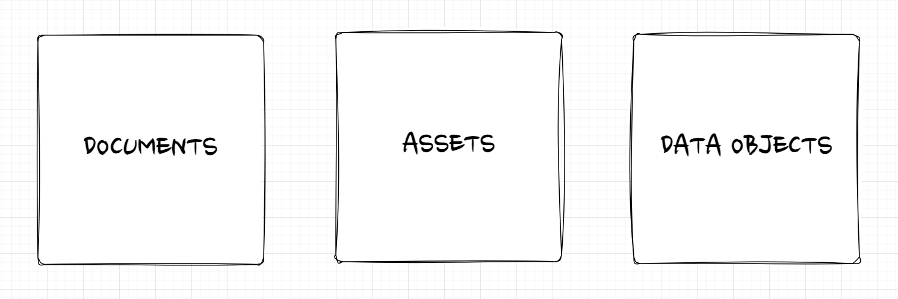
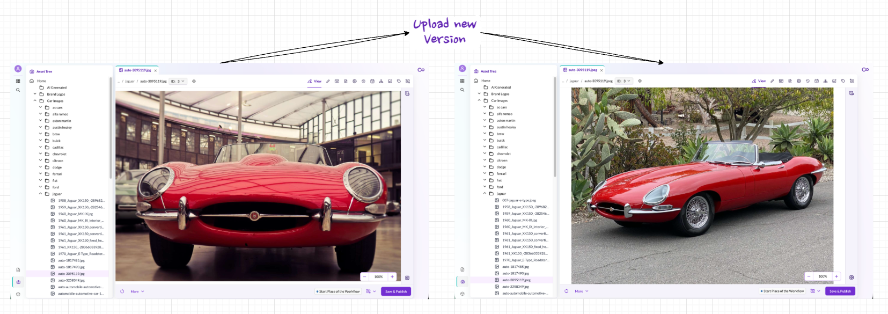

# Pimcore Data Elements

Pimcore manages all data through three fundamental element types: **Documents**, **Assets**, and **Data Objects**. These are the building blocks for all six domains. Every piece of content, every digital file, and every structured record in the system is one of these three types.

Because all three types exist within the same system, they are natively connected. Updating an image in one place updates it everywhere it is used, whether on a website, in a product record, or in an export feed.

## Documents

Documents are the foundation of Pimcore's **DXP/CMS** capabilities. They represent page-based content: websites, emails, newsletters, and other output rendered for end users.

Documents are organized hierarchically in a tree. The tree structure directly maps to the URL structure of the website: a document at `/en/products/overview` in the tree becomes `example.com/en/products/overview` in the browser.

Each document is backed by a Twig template that defines its layout and can contain editable content areas (text, images, video, galleries) that editors fill through Pimcore Studio.

### Document Types

| Type | Purpose |
|------|---------|
| **Page** | A web page. Its path in the document tree corresponds to its URL. |
| **Snippet** | A reusable content fragment that can be embedded in pages or other snippets. |
| **Email** | A page-like document with additional functionality for transactional emails. |
| **Link** | A web link, typically used in navigation structures. |
| **Hardlink** | A reference to another document subtree, allowing content reuse in a different context. |
| **Folder** | Organizational container for grouping documents. |

### Key Capabilities

- **Multi-site** - manage multiple websites from a single Pimcore instance
- **Multi-language** - create localized content with built-in translation support
- **Web-to-print** - generate print-ready output (catalogs, brochures) from the same content
- **Single source publishing** - documents can pull data from Data Objects and Assets, so content is managed once and reused across channels

## Assets

Assets are the foundation of Pimcore's **DAM** (Digital Asset Management). They represent digital files: images, videos, PDFs, Office documents, and any other file type.

Assets are organized in a folder structure and can be enriched with custom metadata, tags, and classifications. Pimcore also reads and displays embedded metadata (EXIF, IPTC, XMP) from files. Format conversion and optimization are handled automatically: upload a single high-resolution image, and the system generates all required output variants (thumbnails, web-optimized formats, specific dimensions) on the fly.

### Key Capabilities

- **Preview** - view files directly in Pimcore Studio without downloading them
- **Custom metadata** - define and manage custom metadata fields to enrich files with project-specific information
- **Embedded metadata** - read and display EXIF, IPTC, and XMP metadata from uploaded files
- **Versioning** - every change creates a new version; previous versions can be compared and restored
- **Thumbnails** - define thumbnail configurations once, and Pimcore generates the output automatically for each asset
- **Permissions** - control access to individual files or entire folders through the role-based permission system

## Data Objects

Data Objects are the foundation of Pimcore's **PIM**, **MDM**, and **CDP** capabilities. They represent structured data: products, categories, customers, suppliers, orders, events, or any other business entity.

The structure of a Data Object is defined by a **class definition**. Class definitions are created and maintained through the visual class editor in Pimcore Studio, no coding required. A class definition specifies which attributes (fields) an object has and what data types they use (text, number, date, relation, select, and many more). Once saved, Pimcore automatically generates the underlying database schema and PHP classes.

### Key Capabilities

- **Flexible data modeling** - define any entity with any combination of data types, from simple text fields to complex relational structures
- **Localization** - fields can be configured as localized, allowing different values per language
- **Inheritance** - child objects can inherit field values from parent objects, reducing redundancy
- **Variants** - model product variants (e.g., sizes, colors) as lightweight children of a parent product
- **Classification store** - handle dynamic, category-specific attributes without changing the class definition
- **Bulk editing** - edit multiple objects at once through folder list views

## How the Three Types Work Together

The real power of Pimcore's data model emerges when the three element types are combined. Consider a product detail page on a website: the page layout is a Document, the product's localized name and description come from a Data Object, and the product images are Assets. All three are linked natively. If the marketing team updates a product image, the new version automatically appears on the website, in the product data export, and in any other channel that references it.

This interconnection is what enables Pimcore's PXM approach: product data, digital assets, and content experiences are managed as a connected whole rather than in isolated silos. The same principle applies to commerce use cases, where Data Objects represent orders and carts, Assets hold product media, and Documents render the shop frontend.

## Shared Capabilities

All three element types share a set of common features:

| Feature | Description |
|---------|-------------|
| **Versioning** | Every save creates a new version. Versions can be compared, and any previous version can be restored. |
| **Properties** | Key-value metadata that can be attached to any element. Properties support inheritance through the tree hierarchy. |
| **Scheduling** | Schedule publish and unpublish actions for a specific date and time. |
| **Dependencies** | Track which elements reference each other: see all items that depend on or are used by the current element. |
| **Tags** | Assign tags for flexible, cross-tree categorization and filtering. |
| **Notes & Events** | Attach notes or track events on any element for auditing and collaboration. |
| **Workflows** | Apply configurable workflow states, transitions, and actions to govern the lifecycle of any element. |
| **Permissions** | Control access at the individual element level through roles and user permissions. |

Detailed documentation on each data type is available in the Core Framework section of this documentation.
