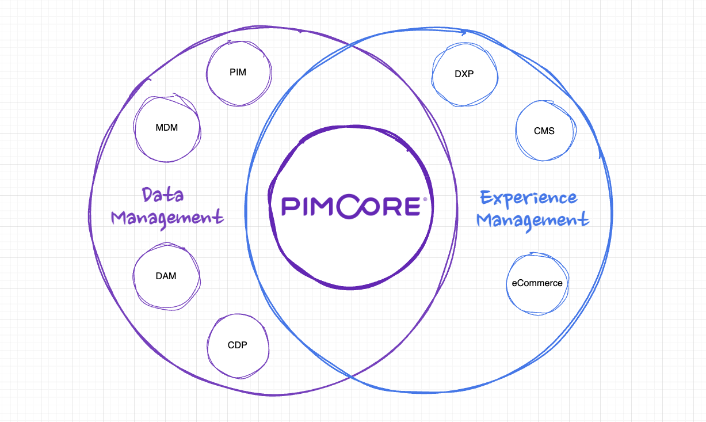

# Pimcore Overview

Pimcore is an open-core platform for **Product Experience Management (PXM)**. It combines data management and experience management in a single system, covering product information, master data, digital assets, customer data, content management, and digital commerce.

PXM goes beyond classic Product Information Management. While PIM focuses on collecting and maintaining product data, PXM covers the entire lifecycle: creating, managing, delivering, and optimizing product data and experiences across all channels. Pimcore integrates the required capabilities into one platform rather than requiring separate tools for each domain.

## The Six Domains

Pimcore combines **Data Management** and **Experience Management** in a single system.

### Data Management

| Domain | What It Does |
|--------|-------------|
| **PIM** - Product Information Management | Central repository for structured product data. Manage attributes, descriptions, translations, and relationships across all channels. |
| **MDM** - Master Data Management | Manage non-product entities such as suppliers, locations, or organizational units. |
| **DAM** - Digital Asset Management | Store, organize, and distribute digital files (images, videos, PDFs, Office documents). Supports file type previews, automatic thumbnail generation, metadata, and version control. |
| **CDP** - Customer Data Platform | Collect and unify customer data from multiple sources into consolidated profiles. Enables segmentation, behavioral tracking, and personalized experiences. |

### Experience Management

| Domain | What It Does |
|--------|-------------|
| **DXP/CMS** - Digital Experience Platform | Create and manage websites, landing pages, and multi-site/multi-language setups using Twig templates with full frontend flexibility. |
| **Digital Commerce** | B2C and B2B online shops, product configurators, and integration with external sales channels, tightly integrated with PIM and DAM. |

All domains share the same data foundation, administration interface (Pimcore Studio), and permission system. You don't need to implement all domains at once. Start with one (e.g., PIM) and extend into others as requirements grow.

## Core Data Elements

All six domains are built on three shared data types: **Data Objects** (structured data), **Assets** (digital files), and **Documents** (page-based content). They exist in the same system and can reference each other natively across domains.

For details on each data type and their shared capabilities, see [Pimcore Data Elements](./03_Pimcore_Data_Elements.md). For an introduction to the administration interface, see [Pimcore Studio UI](02_Pimcore_UI.md).

## Channels and Processes

Pimcore's flexible data model lets you define any entity with any combination of data types. Whether it is product data, customer profiles, supplier records, marketing assets, or website content, all data lives in the same system and can be linked across domains.

Because data is stored independently from its output channel, it can be delivered to any target: websites and web applications (rendered via the built-in CMS or delivered headlessly), mobile apps (via REST or GraphQL APIs), commerce platforms, marketplaces, print catalogs, digital signage, or internal systems like ERP and CRM. The same data serves all channels without channel-specific copies.

Pimcore also supports complex business processes within the same system. Configurable workflows track data through multi-step enrichment and approval processes. Automated data pipelines handle scheduled imports, exports, and transformations between Pimcore and external systems. And Pimcore's event system enables event-driven automation that can be combined with external tools for cross-system orchestration.

## Configurability and Extensibility

Pimcore provides extensive configurable functionality that covers a wide range of use cases without coding customization. 
But being a platform, it can be adapted to virtually any requirement.

### Without Code

Pimcore Studio provides substantial functionality that can be configured without writing custom code, enough to build production-ready solutions for many use cases:

- Data model definition via the class editor
- Workflow management with configurable states, transitions, and actions
- User and role management with granular, element-level permissions
- Import/export configurations
- Perspectives and custom views for role-specific admin layouts

### With Code

For use cases beyond configuration, Pimcore is fully extensible:

- Custom Symfony bundles and Pimcore bundles
- Event listeners for hooking into any core process
- Custom API endpoints
- Custom data types and Pimcore Studio extensions (plugin architecture)
- Access to the full Symfony ecosystem and any PHP library via Composer

## Open Core and Editions

Pimcore follows an open-core model. All source code is released under the Pimcore Open Core License (POCL). A substantial set of components, including the core framework and numerous extensions, is openly available. Enterprise editions provide access to additional modules such as workflow designer, portal engine, or AI-powered features.

For details on available modules and editions, see [Pimcore Platform](../02_Pimcore_Platform/README.md).

## What's Next

- **[Pimcore Studio UI](02_Pimcore_UI.md)** - The administration interface and its core concepts
- **[Pimcore Data Elements](03_Pimcore_Data_Elements.md)** - Documents, Assets, and Data Objects in detail
- **[Pimcore Community](04_Pimcore_Community.md)** - Contributing, source code, and ecosystem resources
- **[Pimcore Platform](../02_Pimcore_Platform/README.md)** - Architecture, available modules, and commercial editions
- **[Getting Started](../03_Getting_Started/README.md)** - Installation, system requirements, and building your first project
