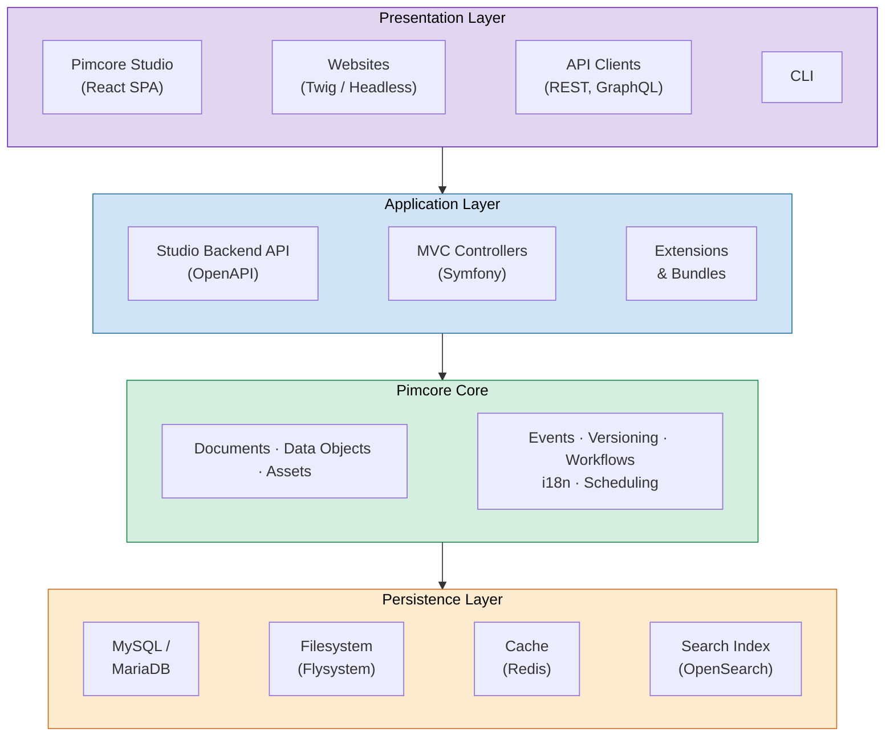

# Pimcore Architecture

Pimcore is built on PHP and the Symfony framework,
following a layered architecture that separates presentation, application logic, core data management, and persistence.
This design allows multiple interfaces - from Pimcore Studio to websites to external API clients -
to operate on the same underlying data through a shared core.

## Architecture Layers

**Presentation Layer** - Multiple interfaces access the same Pimcore Core.
Pimcore Studio is a React-based single-page application for data management, configuration, and administration.
Websites and web applications can use Twig templates rendered by Symfony controllers,
or consume content headlessly via REST or GraphQL APIs.
Background tasks and maintenance run via Symfony Console commands.

**Application Layer** - Two distinct paths serve different use cases.
The Studio Backend exposes a REST API defined with OpenAPI, consumed by Pimcore Studio and other API clients.
For website delivery, standard Symfony MVC controllers handle routing, business logic, and template rendering.
Extensions and bundles hook into both paths via Pimcore's plugin architecture and Symfony's service container.

**Pimcore Core** - The shared foundation that all application paths rely on.
Documents, Data Objects, and Assets provide the three base data types.
Cross-cutting services like event dispatching, versioning, workflow management,
internationalization, and scheduling operate across all data types.
Extensions interact with the core through a well-defined PHP API and event system.

**Persistence Layer** - Storage is abstracted from the core.
Structured data lives in MySQL or MariaDB via Doctrine DBAL.
File storage uses Flysystem, supporting local disk, S3, or other adapters.
Caching is handled by Redis or Symfony's cache component.
Search indexing uses OpenSearch or Elasticsearch via the Generic Data Index.

## Technology Stack

| Component | Technology |
|---|---|
| Language | PHP 8.5+ |
| Framework | Symfony 7 |
| Database | MySQL 8.0+ / MariaDB 10.11+ |
| Templating | Twig |
| Database Abstraction | Doctrine DBAL |
| Async Processing | Symfony Messenger |
| Package Management | Composer |
| Studio UI | React, Ant Design |
| Search Index | OpenSearch / Elasticsearch |
| File Storage | Flysystem |
| Caching | Redis, Symfony Cache |

## Two Application Patterns

### Pimcore Studio

Pimcore Studio provides the administration interface. It consists of two parts:

- **Studio Backend**: A Symfony-based API layer exposing REST endpoints documented with OpenAPI.
  Handles authentication, authorization, data operations, and all administrative functions.
- **Studio UI**: A React single-page application built with Ant Design.
  Communicates exclusively with the Studio Backend API. Extensible through a plugin architecture.

### Website Delivery

Websites and public-facing applications can be built in two ways:

- **Server-rendered (MVC)**: Symfony controllers handle routing and request processing.
  Twig templates render the frontend, with access to Pimcore editables for CMS functionality.
  Pimcore's document tree provides URL routing, complemented by Symfony's standard routing.
- **Headless**: Content is delivered via REST or GraphQL APIs
  (through the [Datahub](./02_Pimcore_Modules.md#data-onboarding--distribution) module),
  consumed by decoupled frontends, mobile apps, or external systems.

Both patterns share the Pimcore Core and persistence layer.
Data created or modified through Pimcore Studio is immediately available for website delivery and vice versa.
