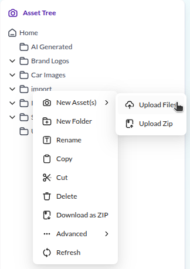

# Assets

In Pimcore, assets are binary files: images, videos, PDFs, Office documents, and any other file type.
You can organize them in directory structures and assign custom metadata.
Once uploaded, an asset can be referenced from multiple places, including documents and data objects.

When uploading images or videos, always upload the highest quality version available.
Pimcore generates optimized thumbnails for different output channels automatically using configurable thumbnail profiles.

## Upload an Image

Log in to Pimcore Studio at [http://localhost/pimcore-studio](http://localhost/pimcore-studio)
and open the **Assets** tree in the left panel. This is where all binary files are organized.

For this tutorial, upload at least one image that you will use as a product picture in the next steps.

There are several ways to upload files:

1. **Drag and drop** files from your file explorer into Pimcore Studio on the desired asset folder.
2. **Right-click** on a folder (e.g. *Home*) in the Assets panel and choose the upload method that suits you.

The uploaded asset is now available for use in data objects and documents throughout your project.

Next, you will [define a data model](./03_Data_Objects.md) and create a product object that uses this image.
