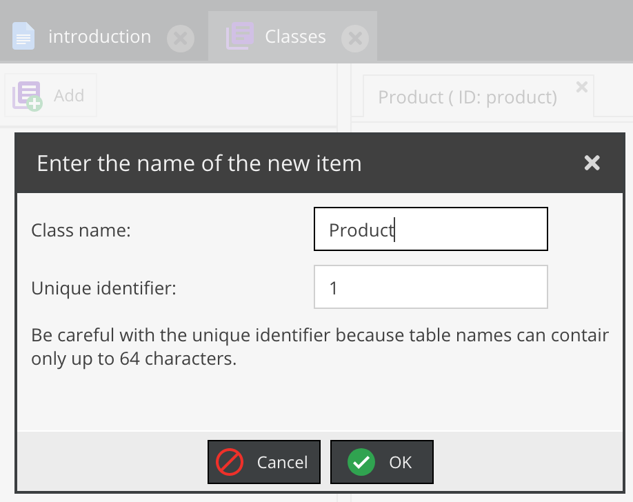
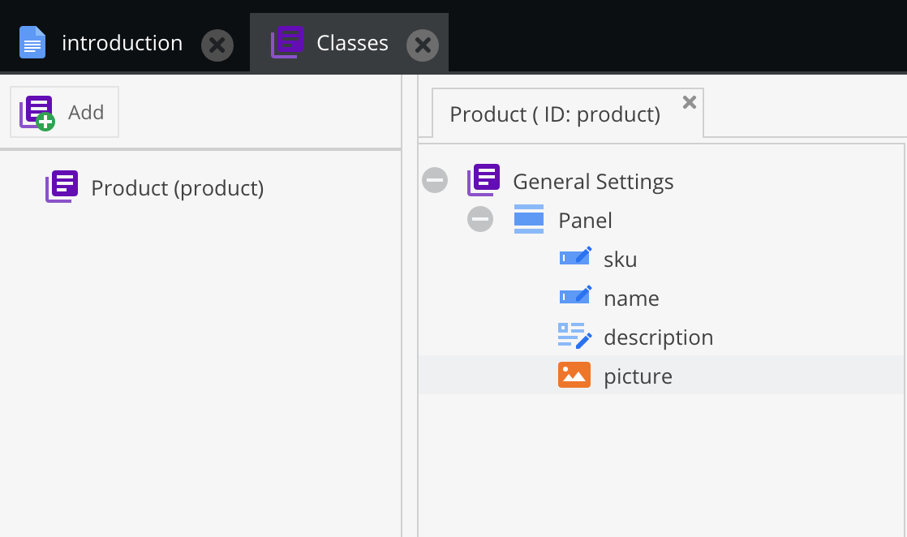
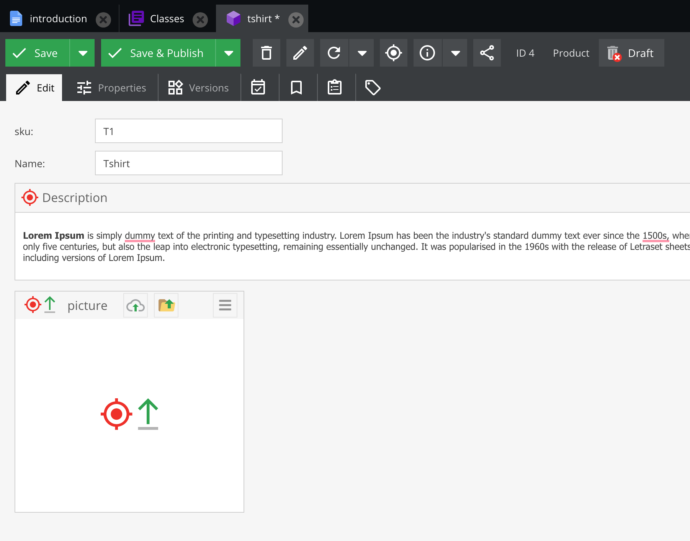
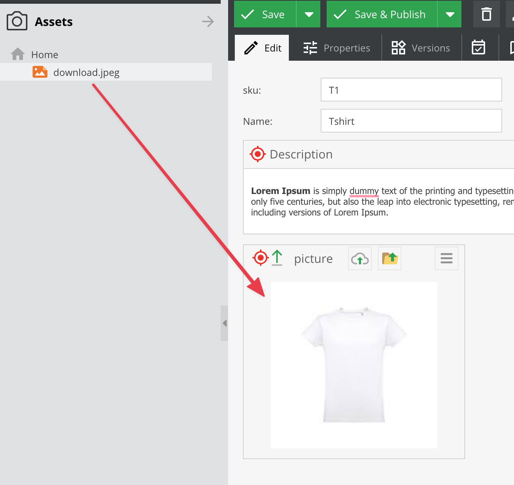

# Data Objects

Data objects store structured data independently from the output channel. They can be used anywhere in your project, whether you are building web pages, feeding an API, or generating a print catalog.

In this tutorial, you will create a simple product data model and then create a product object.

## Create the Class Model

Go to *Settings > Object > Classes* and click *Add Class*.

Name the class **Product**. This creates:
- A database schema for storing product data.
- A generated PHP class (`var/classes/DataObject/Product.php`) with getters and setters for each attribute.

## Define Attributes

The product should have four attributes: **SKU**, **name**, **description**, and **picture**.

Add them to the class definition:

1. In the class editor, right-click on the *Base* node (the root of the layout tree) and select *Add Layout Component > Panel*. This is the main container for the product attributes.
2. Right-click on *Panel*, then *Add data component > Text > Input*. Change the name to **sku**.
3. Add another *Text > Input* and name it **name**.
4. Add *Text > WYSIWYG* and name it **description**.
5. Add *Other > Image* and name it **picture**.

The finished class definition should look like this:

Click *Save* to persist the class definition.

## Add a New Object

Now create a product using the class you just defined:

1. Open the Objects panel on the left and right-click on *Home* (you can also create directory structures for organizing objects).
2. Choose *Add object > Product* and enter a name, for example: **tshirt**.
3. Fill in values for SKU, name, and description.
4. For the picture attribute, either click the upload button  or drag an asset from the Assets panel.
5. Click *Save & Publish*.

The completed object with all attributes filled:

For detailed information about data objects, classes, and data types, see the Objects documentation in the Pimcore Core reference.

In the next step, you will [create CMS pages](./04_Documents.md) that display this product on the frontend.
