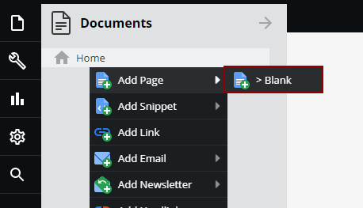
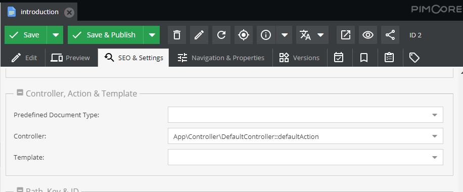
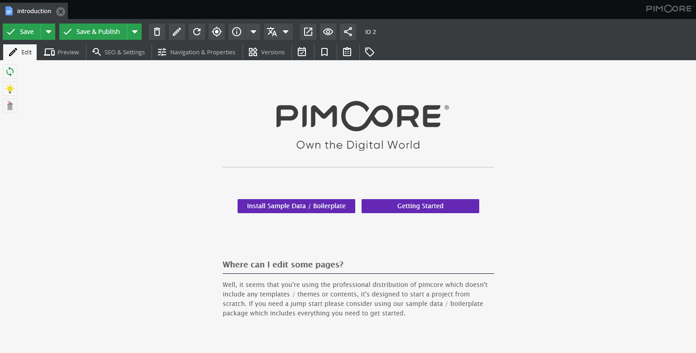
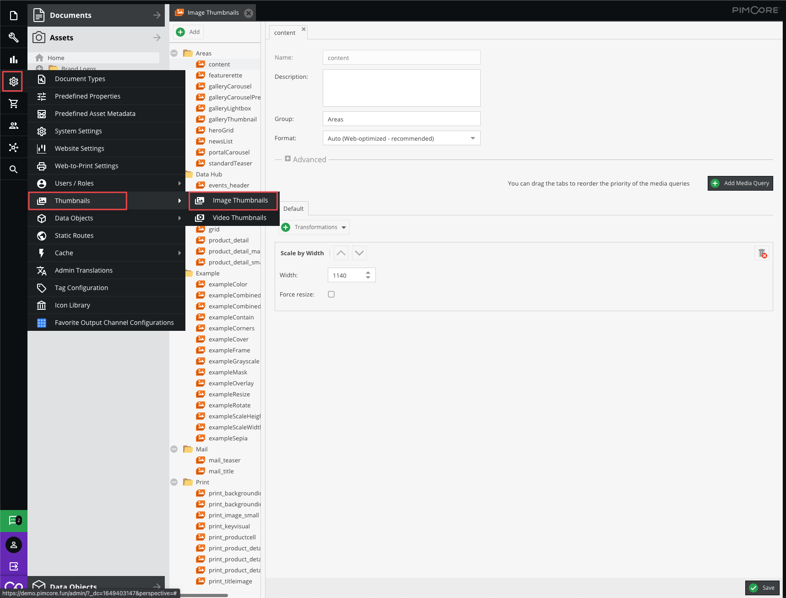
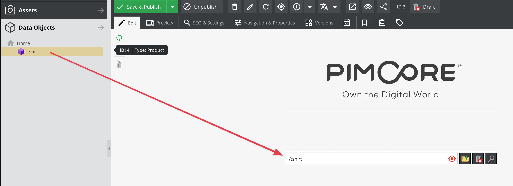
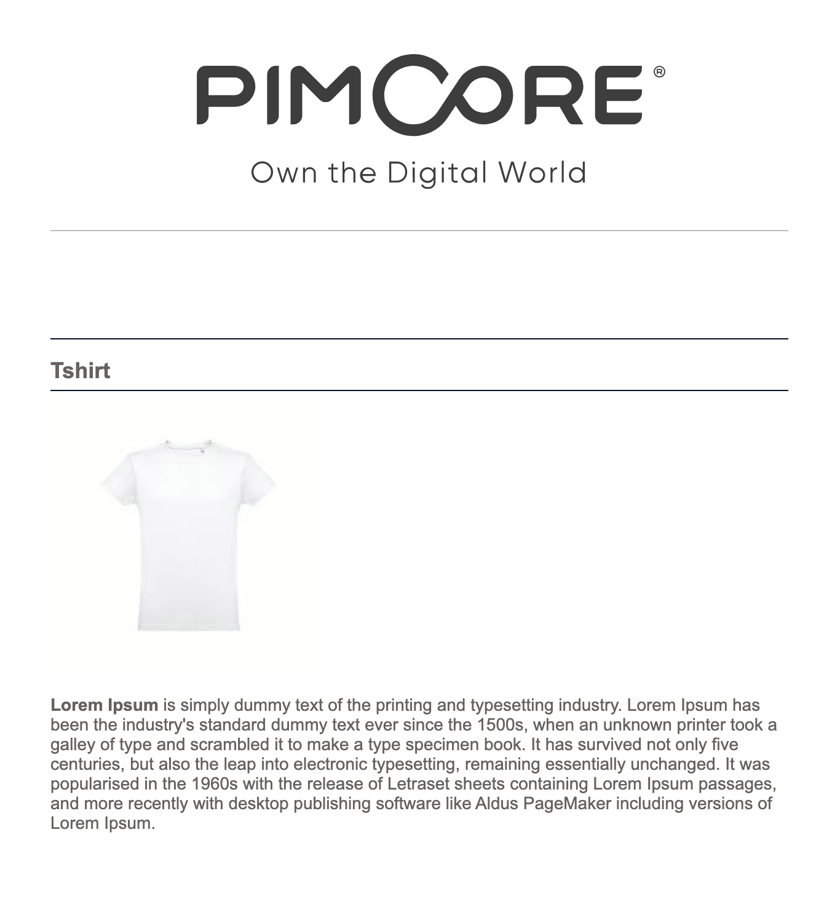

# Documents

Documents are CMS pages in Pimcore. Each document is backed by a Symfony controller and a Twig template,
and can contain editable regions that content editors fill through Pimcore Studio.
In this tutorial, you will create a content page, then build a product page that displays data
from the object you created earlier.

## Create a Controller

Create a file called `ContentController.php` in the `/src/Controller` directory:

```php
<?php

namespace App\Controller;

use Pimcore\Controller\FrontendController;
use Symfony\Bridge\Twig\Attribute\Template;
use Symfony\Component\HttpFoundation\Request;

class ContentController extends FrontendController
{
    #[Template('content/default.html.twig')]
    public function defaultAction(Request $request): array
    {
        return [];
    }
}
```

The `defaultAction` renders the template `content/default.html.twig`.
For now, the action is empty since the template handles the editable content.

## Create a Template

Create the file `/templates/content/default.html.twig`:

```twig



    <h1>{{ pimcore_input("headline", {"width": 540}) }}</h1>

    
        <h2>{{ pimcore_input('subline') }}</h2>
        {{ pimcore_wysiwyg('content') }}
    

```

Pimcore uses the Symfony Twig engine and adds its own *editables* - placeholders like `pimcore_input`,
`pimcore_block`, and `pimcore_wysiwyg` that become editable fields in Pimcore Studio.
For the full list, see the [Editables documentation](https://github.com/pimcore/pimcore/blob/2026.x/doc/01_Documents/01_Templates/03_Editables/README.md) in the Documents reference.

## Add a Layout

Create the file `/templates/layout.html.twig`. This layout wraps all pages and provides the HTML skeleton:

```twig
<!DOCTYPE html>
<html lang="en">
<head>
    <meta charset="UTF-8">
    <title>Example</title>
    <style>
        body {
            padding: 0;
            margin: 0;
            font-family: "Lucida Sans Unicode", Arial;
            font-size: 14px;
        }

        #site {
            margin: 0 auto;
            width: 600px;
            padding: 30px 0 0 0;
            color: #65615E;
        }

        h1, h2, h3 {
            font-size: 18px;
            padding: 0 0 5px 0;
            border-bottom: 1px solid #001428;
            margin-bottom: 5px;
        }

        h3 {
            font-size: 14px;
            padding: 15px 0 5px 0;
            margin-bottom: 5px;
            border-color: #cccccc;
        }

        img {
            border: 0;
        }

        p {
            padding: 0 0 5px 0;
        }

        a {
            color: #000;
        }

        #logo {
            text-align: center;
            padding: 50px 0;
        }

        #logo hr {
            display: block;
            height: 1px;
            overflow: hidden;
            background: #BBB;
            border: 0;
            padding: 0;
            margin: 30px 0 20px 0;
        }

        .claim {
            text-transform: uppercase;
            color: #BBB;
        }

        #site ul {
            padding: 10px 0 10px 20px;
            list-style: circle;
        }

        .buttons {
            margin-bottom: 100px;
            text-align: center;
        }

        .buttons a {
            display: inline-block;
            background: #6428b4;
            color: #fff;
            padding: 5px 10px;
            margin-right: 10px;
            width: 40%;
            border-radius: 2px;
            text-decoration: none;
        }

        .buttons a:hover {
            background: #1C8BC1;
        }

        .buttons a:last-child {
            margin: 0;
        }

    </style>
</head>
<body>
    <div id="site">
        <div id="logo">
            <a href="http://www.pimcore.com/"></a>
            <hr/>
        </div>
        {{ block('content') }}
    </div>
</body>
</html>
```

The `{{ block('content') }}` placeholder is where each page's content is inserted.

## Connect Controller to a Document

Now connect the controller action to a page in Pimcore Studio
so the page knows which action (and template) to use.

1. In the *Documents* panel, right-click on *Home* and select *Add Page > Empty Page*.

<div class="image-as-lightbox"></div>



2. Open the *Settings* tab and select the controller and action.

<div class="image-as-lightbox"></div>



3. Save the document (*Save & Publish*), then switch to the *Edit* tab to see the editable placeholders.

<div class="image-as-lightbox"></div>



## Create a Product Page

Now connect a data object to a document to display product information.

### Add a Product Action

Update `/src/Controller/ContentController.php` to include the new `productAction` method:

```php
<?php

namespace App\Controller;

use Pimcore\Controller\FrontendController;
use Symfony\Bridge\Twig\Attribute\Template;
use Symfony\Component\HttpFoundation\Request;
use Symfony\Component\HttpFoundation\Response;

class ContentController extends FrontendController
{
    #[Template('content/default.html.twig')]
    public function defaultAction(Request $request): array
    {
        return [];
    }

    public function productAction(Request $request): Response
    {
        return $this->render('content/product.html.twig');
    }
}
```

### Create the Product Template

Create the file `/templates/content/product.html.twig`:

```twig



    <h1>{{ pimcore_input("headline", {"width": 540}) }}</h1>

    <div class="product-info">
        
            {{ pimcore_relation("product") }}
        
            
            
                <h2>{{ product.name }}</h2>
                <div class="content">
                    
                        {{ product.picture.thumbnail("content").html|raw }}
                    

                    {{ product.description|raw }}
                </div>
            
        
    </div>

```

Key concepts in this template:

- `editmode` is a built-in variable that is `true` when the page is being edited in Pimcore Studio.
  This lets you show different content in edit mode vs. the frontend.
- `pimcore_relation("product")` creates an editable placeholder for a 1-to-1 relation. In edit mode,
  it renders a drop zone where you can drag a data object. In frontend mode, `.element` gives you access
  to the linked object and all its attributes.
- `product.picture.thumbnail("content").html` renders an `` tag using the "content" thumbnail configuration
  (see below). The tag includes the correct image path and alt attributes based on asset metadata.

### Configure a Thumbnail

To display the product image, you need a thumbnail configuration.
Thumbnail configurations let Pimcore automatically render optimized images for different output channels,
including high-resolution @2x versions.

In Pimcore Studio, navigate to *Settings > Assets > Thumbnails > Image Thumbnails* and create a new thumbnail
configuration named **content**. Set the width to 600 pixels and leave other fields at their defaults.

<div class="image-as-lightbox"></div>



### Link the Product Object to a Document

1. In the Documents panel, right-click on *Home*, then select *Add Page > Empty Page*.
2. Set the document key to **tshirt** if you want the page to be reachable at `http://localhost/tshirt`. If you choose a different key, use that path instead.
3. In the *Settings* tab, choose the `Content` controller and the `product` action. Click *Save*.
4. In the *Edit* tab, drag the product object from the Objects panel onto the relation placeholder.
5. Click *Save & Publish*.

<div class="image-as-lightbox"></div>



### View the Result

Open the product page in your browser (e.g. `http://localhost/tshirt` where *tshirt* is the document name).

The page displays the product name, description, and image using data from the linked object:

<div class="image-as-lightbox"></div>



## Next Steps

Once you are comfortable with the basics covered in this tutorial,
explore the detailed reference documentation for each element type in the Pimcore Core section:
[Documents](https://github.com/pimcore/pimcore/blob/2026.x/doc/01_Documents/README.md) (page types, editables, properties),
[Objects](https://github.com/pimcore/pimcore/blob/2026.x/doc/03_Objects/README.md) (class definitions, data types, inheritance),
and [Assets](https://github.com/pimcore/pimcore/blob/2026.x/doc/02_Assets/README.md) (thumbnails, metadata, versioning).
