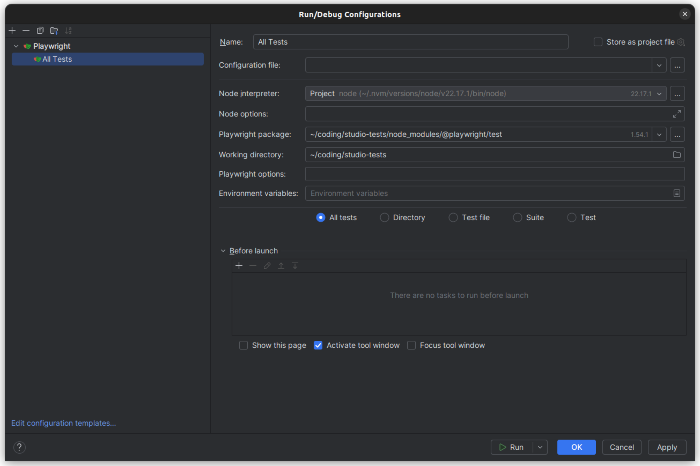

# PHPStorm Setup Guide

## Prerequisites

1. **Node.js** must be installed (e.g. via [nvm](https://github.com/nvm-sh/nvm))
2. **Platform Test setup** must be running — see [Platform Version Test Setup](./01_API_TESTS.md) for the required configuration
3. Dependencies installed (`npm install`)

## Run/Debug Configuration

1. Open **Run > Edit Configurations...** in PHPStorm
2. Click **+** and select **Playwright**
3. Configure the following fields:
   - **Name**: `All Tests` (or any name you prefer)
   - **Node interpreter**: Select your Node.js installation (e.g. `~/.nvm/versions/node/v22.17.1/bin/node`)
   - **Playwright package**: `<project-root>/node_modules/@playwright/test`
   - **Working directory**: `<project-root>` (the root of this repository)
   - **Test scope**: Select **All tests** to run the full suite, or choose **Test file** / **Test** to run specific tests
4. Click **OK**

You can now run and debug Playwright tests directly from PHPStorm using the green play button.
